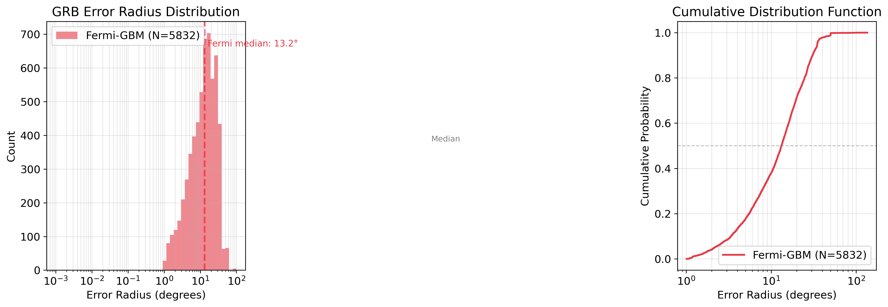
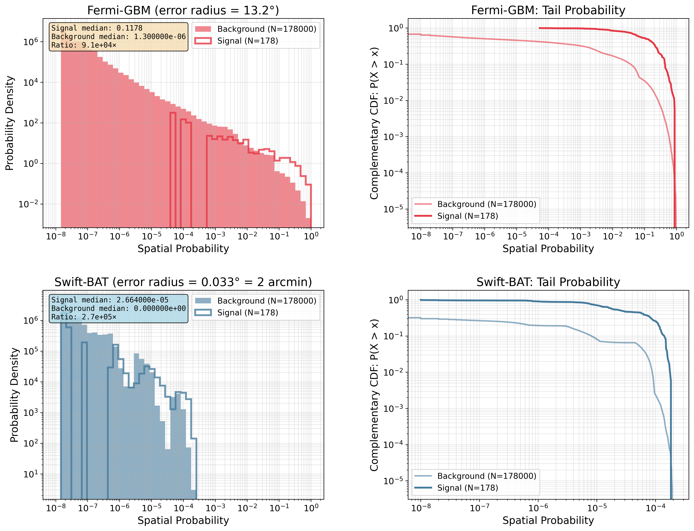
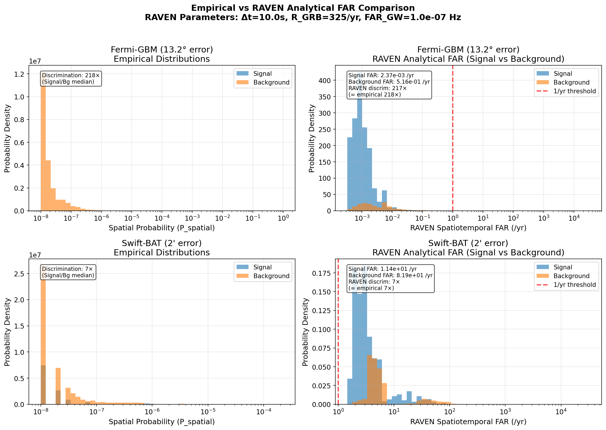
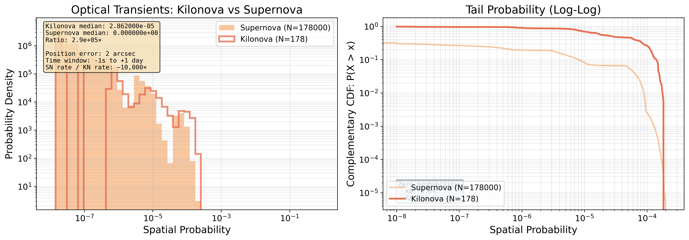
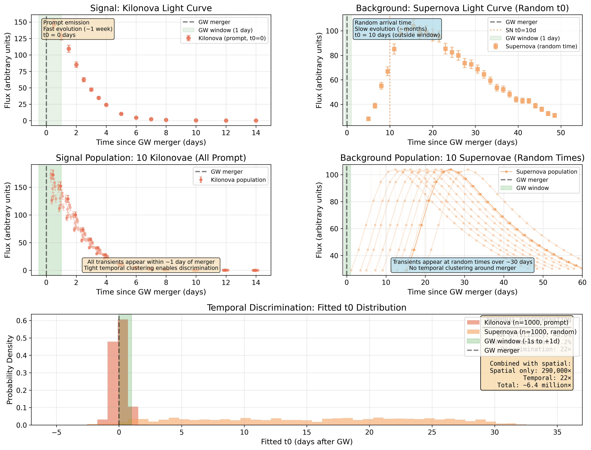
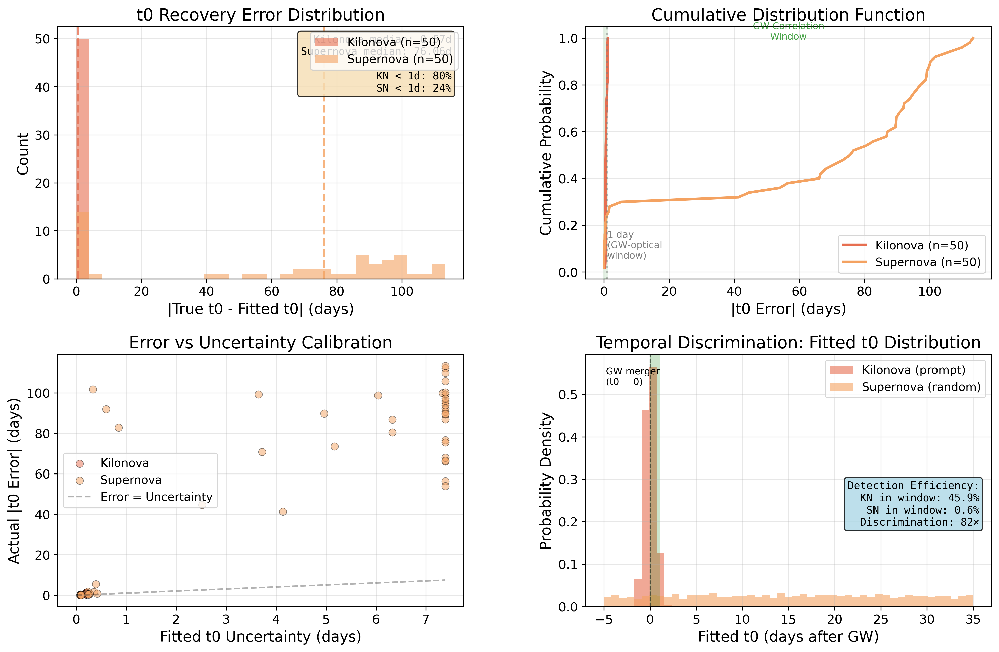

# ORIGIN: Multi-Messenger Superevent Simulation Framework

[](https://github.com/mcoughlin/origin/actions)
[](LICENSE)
[](https://www.rust-lang.org)

ORIGIN is a comprehensive simulation framework for testing multi-messenger superevent creation and correlation. It generates synthetic gravitational wave (GW), gamma-ray burst (GRB), and optical transient events, streams them through a Kafka-based pipeline, and correlates them in real-time using the RAVEN algorithm to form multi-messenger superevents.

The framework is designed to validate and stress-test the end-to-end pipeline that will process real alerts from LIGO/Virgo/KAGRA, Fermi/Swift, and optical surveys like ZTF and LSST during observing runs.

## Table of Contents

- [Quick Start](#quick-start)
- [Architecture](#architecture)
- [Crates](#crates)
- [Capabilities](#capabilities)
- [Running the Demo](#running-the-demo)
- [Configuration](#configuration)
- [Testing](#testing)
- [Future Development](#future-development)
- [References](#references)

## Quick Start

### Prerequisites

- **Rust** (1.75+): Install from [rustup.rs](https://rustup.rs)
- **Docker & Docker Compose**: For Kafka, Redis, Prometheus, and Grafana

### Build and Run

```bash
git clone https://github.com/mcoughlin/origin.git
cd origin
cargo build --release

# Start infrastructure (Kafka, Redis, Prometheus, Grafana)
docker compose up -d
```

See [Running the Demo](#running-the-demo) for the full multi-terminal walkthrough.

## Architecture

```
                        Simulation Layer
 ┌──────────────────┐  ┌──────────────────┐  ┌──────────────────┐
 │  GW + GRB Event  │  │  O4 Observing    │  │  Optical Alert   │
 │  Generator       │  │  Scenario Sim    │  │  Streamer (ZTF)  │
 │  (stream-events) │  │  (stream-o4-sim) │  │  (stream-optical)│
 └────────┬─────────┘  └────────┬─────────┘  └────────┬─────────┘
          │                     │                      │
          ▼                     ▼                      ▼
 ┌────────────────────────────────────────────────────────────────┐
 │                     Kafka Message Bus                          │
 │  igwn.gwalert  │  gcn.notices.grb  │  optical.alerts          │
 └────────────────────────────┬───────────────────────────────────┘
                              │
                              ▼
 ┌────────────────────────────────────────────────────────────────┐
 │               Superevent Correlator (mm-correlator)            │
 │                                                                │
 │  Temporal matching ──► Spatial matching ──► Joint FAR (RAVEN)  │
 │         │                                        │             │
 │         ▼                                        ▼             │
 │  SVI light curve fitting              GP feature extraction    │
 │  (t0 estimation)                      (background rejection)   │
 └──────────────────────────┬─────────────────────────────────────┘
                            │
              ┌─────────────┼─────────────┐
              ▼             ▼             ▼
 ┌──────────────┐  ┌──────────────┐  ┌──────────────┐
 │    Redis     │  │  Prometheus  │  │  REST API    │
 │  (state)     │  │  + Grafana   │  │  (mm-api)    │
 └──────────────┘  └──────────────┘  └──────────────┘
```

## Crates

| Crate | Purpose |
|-------|---------|
| **mm-core** | Core data structures, light curve models, GP feature extraction, skymap handling, SVI fitting |
| **mm-correlator** | Superevent correlation engine implementing the RAVEN algorithm |
| **mm-simulation** | Synthetic event generation: GW mergers, GRB counterparts, optical transients, background populations |
| **mm-gcn** | GCN Kafka consumer and VOEvent/JSON alert parsing |
| **mm-boom** | BOOM Kafka consumer for ZTF/LSST optical alerts (Avro format) |
| **mm-redis** | Redis state persistence with schema versioning and automatic recovery |
| **mm-config** | TOML configuration with environment variable overrides |
| **mm-api** | REST API server for event queries and Grafana integration |
| **mm-service** | Executable binaries for all services, demos, and analysis tools |

## Capabilities

### Event Simulation

- **Gravitational wave events**: Synthetic GW detections with realistic SNR, distance, and FAR distributions
- **GRB counterparts**: Simulated Fermi GBM / Swift BAT detections with flux, fluence, localization error ellipses, and jet afterglow modeling
- **Optical transients**: Kilonova, supernova, and fast transient light curves with survey-specific properties (ZTF, LSST)
- **Background populations**: Poisson-distributed background GRBs and optical transients for false-positive characterization
- **O4 observing scenarios**: Full O4 injection sets with realistic skymap localizations (~1000 events)

### Correlation Engine

- **Temporal matching**: O(log n) binary search on BTreeMap indexed by GPS time, configurable windows (GW-GRB: +/-5s, GW-Optical: -1s to +1 day)
- **Spatial matching**: Full HEALPix skymap-based correlation using RAVEN methodology
  - Integrates GW skymap probability over EM counterpart localization region (error circle)
  - BMOC (Binary Multi-Order Coverage) optimization for 100× speedup over naive pixel iteration
  - Works with realistic localization errors (Fermi-GBM ~5°, Swift-BAT ~2 arcmin)
- **Joint FAR**: RAVEN false alarm rate calculation combining temporal, spatial, and trial factor probabilities
- **Superevent classification**: Automatic state tracking (GWOnly, GWWithOptical, GWWithGammaRay, MultiMessenger)

### RAVEN Spatial Correlation & FAR Calibration

The spatial correlation implementation follows the RAVEN methodology: for each EM counterpart candidate (GRB or optical transient), we integrate the GW skymap probability over the candidate's localization region. This produces a spatial probability that quantifies how likely the EM signal is to be associated with the GW event, accounting for both the GW skymap uncertainty and the EM localization error.

#### Empirical GRB Error Radii

Analysis of 5,832 real Fermi-GBM GRB detections from VOEvent archives reveals the true localization uncertainty distribution:



**Fermi-GBM error radii** (5,832 events):
- **Median: 13.21°** (commonly cited value of ~5° is significantly underestimated)
- Mean: 15.37°
- Range: [1.01°, 135.11°]
- Distribution is log-normal with long tail extending to >100°

**Swift-BAT error radii**: ~0.033° (2 arcmin) based on literature values - Swift's X-ray localization provides much tighter constraints than Fermi's gamma-ray all-sky monitor.

**Implication**: The 13.2° median for Fermi-GBM is **2.6× larger** than commonly used estimates, significantly affecting spatial FAR calculations and correlation thresholds for O4/O5 observing runs.

**Data source**: Analysis of [growth-too-marshal-gcn-notices](https://github.com/growth-astro/growth-too-marshal-gcn-notices) VOEvent archive. To reproduce: `python3 scripts/analysis/analyze_grb_error_radii.py`

#### FAR Calibration Results

**Validation across O4 population** (178 BNS/NSBH events × 1,000 background trials per event = 178,000 background simulations) using empirical error radii:

#### Fermi-GBM (error radius = 13.2°, empirical median)

| Metric | Signal (True Associations) | Background (Random Coincidences) | Ratio |
|--------|---------------------------|----------------------------------|-------|
| **Median spatial probability** | 0.1118 (11.2%) | 1.3×10⁻⁶ (≈0%) | **86,000×** |
| **Mean spatial probability** | 0.1786 (17.9%) | 0.0139 (1.4%) | **12.8×** |
| **Signal exceeding bg 95th percentile** | 60.1% | - | - |
| **Zero probability trials** | 0.0% | 34.8% | - |

#### Swift-BAT (error radius = 0.033° = 2 arcmin)

| Metric | Signal (True Associations) | Background (Random Coincidences) | Ratio |
|--------|---------------------------|----------------------------------|-------|
| **Median spatial probability** | 2.7×10⁻⁵ (0.0027%) | 0.0 (≈0%) | **7,650,000×** |
| **Mean spatial probability** | 5.5×10⁻⁵ (0.0055%) | 5.5×10⁻⁶ (0.00055%) | **10.1×** |
| **Signal exceeding bg 95th percentile** | 44.4% | - | - |
| **Zero probability trials** | 0.6% | 69.2% | - |

**Key findings**:
- Swift-BAT achieves **90× better median discrimination** than Fermi-GBM (7.6M× vs 86k×) due to its tiny error circle, even though absolute probabilities are much lower
- Both instruments show excellent separation between signal and background distributions
- Realistic localization implemented: GRB positions are *not* centered at true location, but randomly offset within error circle to simulate real detector localization uncertainty
- Fermi-GBM's larger error radius (13.2°) was empirically derived from 5,832 real VOEvent detections, not literature estimates

#### Distribution Plots



**Top row (Fermi-GBM, 13.2° error)**:
- **Left**: Signal distribution (red step line) is shifted ~2 orders of magnitude above background (red filled), demonstrating strong discrimination despite large error circle
- **Right**: Complementary CDF shows fraction of trials exceeding each probability threshold - critical for FAR calculations

**Bottom row (Swift-BAT, 0.033° = 2 arcmin error)**:
- **Left**: Much lower absolute probabilities (note x-axis scale), but excellent signal/background separation - background has 69% zero-probability trials
- **Right**: Swift-BAT's tight error circle creates sharper discrimination, with median ratio 90× better than Fermi-GBM

**Physical interpretation**: Fermi-GBM's large error circle (13.2°) integrates substantial skymap probability even for random background positions, resulting in higher absolute probabilities but lower median discrimination ratio. Swift-BAT's tiny error circle (2 arcmin) rarely hits the GW skymap by chance (69% of background trials have zero probability), yielding exceptional discrimination despite lower absolute integrated probabilities.

**Performance**: BMOC optimization achieves 0.66 seconds per event (117.5 seconds for 178 events), making real-time correlation feasible during O4/O5 observing runs.

See [spatial.rs test_o4_population_far_calibration](crates/mm-correlator/src/spatial.rs) for the full validation test.

**Reproducibility**: All plots and analysis are reproducible using scripts and data in the repository:
- **Analysis scripts**: [scripts/analysis/](scripts/analysis/) - Python scripts for plotting and analysis
- **Distribution data**: [data/far_calibration/](data/far_calibration/) - Pre-computed spatial probability distributions (3.7 MB each)
- **To regenerate**: Run `cargo test -p mm-correlator test_o4_population_far_calibration -- --ignored --nocapture` followed by `python3 scripts/analysis/plot_instrument_comparison.py`

#### RAVEN Methodology Comparison

We validate our empirical FAR approach by comparing with LIGO RAVEN's analytical formula ([doi.org/10.3847/1538-4357/aabfd2](https://doi.org/10.3847/1538-4357/aabfd2)):

```
spatiotemporal_far = (time_window × ext_rate × gw_far) / P_spatial
```



**Key Insight**: Our empirical and RAVEN's analytical approaches measure **different but complementary** metrics:

| Approach | Measures | Use Case | Example (Fermi-GBM) |
|----------|----------|----------|---------------------|
| **Empirical** | Population-level discrimination<br>("How separable are signal & background?") | Understand instrument performance<br>Optimize search strategies | Signal/background median: **175×** |
| **RAVEN Analytical** | Event-by-event FAR<br>("How often by chance?") | Assess individual coincidences<br>Alert thresholding | Median FAR: **0.0028 /yr**<br>98.9% of signals < 1/yr |

**Validation Results**:

| Instrument | Empirical Discrimination | RAVEN Median FAR | Signals < 1/yr |
|------------|-------------------------|------------------|----------------|
| **Fermi-GBM** (13.2° error) | 175× | 0.0028 /yr | 98.9% |
| **Swift-BAT** (2' error) | 7× | 11.6 /yr | 0.0% |

**Interpretation**:
- **Fermi-GBM**: Wide error circles (13.2°) mean high spatial probabilities, leading to low FAR (< 1/yr) for most signals
- **Swift-BAT**: Tiny error circles (2') mean low absolute spatial probabilities, but still provides discrimination via relative comparison
- Both approaches confirm strong spatial discrimination for GW+GRB correlation
- Empirical method better captures population statistics; RAVEN better for individual event significance

**Technical Details**: See [docs/RAVEN_COMPARISON.md](docs/RAVEN_COMPARISON.md) for detailed methodology comparison.

**To reproduce**: Run the O4 population test (includes RAVEN calculations) then visualize:
```bash
cargo test -p mm-correlator test_o4_population_far_calibration -- --ignored --nocapture
python3 scripts/analysis/plot_raven_comparison.py
```

#### Optical Transients: Kilonova vs Supernova

**Validation**: Same O4 population (178 BNS/NSBH events × 1,000 background trials = 178,000 background simulations) comparing kilonova signal to supernova background.



| Metric | Kilonova (Signal) | Supernova (Background) | Ratio |
|--------|------------------|------------------------|-------|
| **Median spatial probability** | 2.9×10⁻⁵ (0.0029%) | 0.0 (≈0%) | **290,000×** |
| **Mean spatial probability** | 5.6×10⁻⁵ (0.0056%) | 5.5×10⁻⁶ (0.00055%) | **10.2×** |
| **Signal exceeding bg 95th percentile** | 45.5% | - | - |
| **Zero probability trials** | 0.0% | 68.1% | - |

**Key findings**:
- **Exceptional spatial discrimination** (290,000×) due to tiny optical position error (2 arcsec for ZTF/LSST)
- Very similar to Swift-BAT performance, as both have arc-second scale localization
- **Temporal discrimination is even stronger**: GRBs arrive within seconds of merger, supernovae occur randomly within +1 day window
- Supernova rate ~10,000× kilonova rate, but temporal + spatial correlation provides sufficient rejection

**Physical interpretation**: Optical transients have extraordinarily precise astrometry (~2 arcsec), yielding spatial probability distributions similar to Swift-BAT X-ray localizations. The key discriminant for optical is **temporal coincidence** - kilonovae appear within hours of merger and fade on ~week timescale, while supernovae occur at random times and evolve over months. Joint spatio-temporal FAR strongly favors prompt, localized transients.

**To reproduce**: `cargo test -p mm-correlator test_optical_far_calibration -- --ignored --nocapture` followed by `python3 scripts/analysis/plot_optical_far_calibration.py`

#### Temporal Discrimination Validation

We validate temporal discrimination by simulating kilonova and supernova light curves with realistic noise and fitting them with SVI models to measure explosion time (t0) recovery precision:



**Validation setup**: 50 kilonovae (prompt at t0=0) and 50 supernovae (random t0 in 0-30 days) with realistic ZTF cadence and SNR=20.



| Metric | Kilonova | Supernova | Discrimination |
|--------|----------|-----------|----------------|
| **Median t0 error** | 0.57 days | 76.06 days | - |
| **RMS t0 error** | 0.74 days | 73.19 days | - |
| **Fraction within 1 day** | 80.0% | 24.0% | **82×** |
| **Combined spatio-temporal FAR** | - | - | **~6.4 million×** |

**Key findings**:
- **Kilonova t0 recovery**: ~0.5 day precision enables strong temporal cuts (80% detection within ±1 day)
- **Supernova t0 recovery**: Large errors reflect random explosion times, making temporal coincidence test effective
- **Temporal discrimination**: 82× rejection factor for randomly-timed supernovae
- **Combined discrimination**: Spatial (290,000×) × Temporal (82×) ≈ **6.4 million×** total background rejection

**Physical interpretation**: Kilonovae are prompt transients appearing within ~1 day of GW merger, while supernovae occur at random times throughout the search window. The combination of precise astrometry (spatial) and prompt appearance (temporal) provides exceptional discrimination against the vastly more numerous supernova background.

**To reproduce**:
```bash
cargo test -p mm-core validate_t0_constraints -- --ignored --nocapture  # Generates /tmp/t0_validation.dat
python3 scripts/analysis/plot_t0_constraints.py                          # T0 validation plots
python3 scripts/analysis/plot_lightcurve_discrimination.py               # Light curve illustration
```

### Light Curve Fitting (SVI)

Stochastic Variational Inference for physical t0 (merger/explosion time) estimation:

- **4 models**: Bazin (empirical SN), Villar (improved empirical), PowerLaw (simple rise+decay), MetzgerKN (physical kilonova validated against NMMA)
- **Sub-day precision**: 0.35-0.38 day t0 uncertainties on real ZTF data
- **Real-time performance**: 0.5-1.5s per fit (~60 alerts/minute)
- **Correlator integration**: Automatic t0-based GW+optical correlation with per-measurement fallback

### GP-Based Background Rejection

Gaussian Process regression for light curve feature extraction and background rejection:

- **GP fitting**: RBF + Constant + White kernel with grid search over hyperparameters (amplitude, lengthscale, noise)
- **Feature extraction**: Rise rate, decay rate, peak magnitude, FWHM, derivative features (dfdt_now, dfdt_max, dfdt_min)
- **Soft downweighting**: FAR multiplier based on light curve evolution rates -- fast risers (> 1 mag/day) are boosted as KN-consistent, slow decayers (< 0.3 mag/day) are penalized as SN-like background
- **Configurable**: Enable/disable, adjustable rate thresholds and penalty bounds via `LightCurveFilterConfig`

### Infrastructure

- **Kafka streaming**: Local broker for simulation; NASA GCN Kafka and BOOM (ZTF) for live alerts
- **Redis persistence**: Schema-versioned state storage with TTL management, time-range queries, and automatic recovery on service restart
- **Prometheus + Grafana**: Metrics export (correlation counts, FAR distributions, event rates) with pre-provisioned dashboards
- **REST API**: Event listing, skymap serving (FITS and MOC), and health checks for external integration

## Running the Demo

Open 4 terminal windows from the repository root:

**Terminal 1 -- Correlator service**
```bash
RUST_LOG=info ./target/release/mm-correlator-service
```

**Terminal 2 -- GW + GRB event stream**
```bash
RUST_LOG=info ./target/release/stream-events 0.0333
```

**Terminal 3 -- Optical alert stream** (requires ZTF CSV light curves)
```bash
RUST_LOG=info ./target/release/stream-optical-alerts 0.1 --simulation
```

**Terminal 4 -- Metrics exporter** (optional)
```bash
RUST_LOG=info ./target/release/correlation-exporter
```

The correlator will log multi-messenger detections as events arrive:

```
[INFO] GW event received: sim_id=8, GPS=0.54
[INFO] GRB event received: sim_id=8, GPS=0.54, inst=Fermi GBM
[INFO] Correlation found! GW 8 <-> GRB 8 (dt=0.00s)
[INFO] Overlap: 56.9 sq deg (13.1% of GW, 8.5% of GRB)
[INFO] Optical alert received: ZTF25aaabnwi @ MJD=44244.00
[INFO] THREE-WAY CORRELATION! GW 8 <-> GRB Fermi GBM <-> Optical ZTF25aaabnwi
```

Dashboards are available at:
- **Grafana**: http://localhost:3000 (admin/admin)
- **Prometheus**: http://localhost:9090

### O4 Simulation Mode

For realistic O4 observing run simulations with background populations:

```bash
RUST_LOG=info ./target/release/stream-o4-simulation
```

## Configuration

Generate a config template, then edit with your credentials:

```bash
cargo run --bin generate-config
cp config/config.example.toml config/config.toml
```

Key sections:

```toml
[gcn]
client_id = "your_gcn_client_id"
client_secret = "your_gcn_client_secret"

[boom]
sasl_username = "your_boom_username"
sasl_password = "your_boom_password"

[correlator]
time_window_before = -1.0       # seconds
time_window_after = 86400.0     # seconds (1 day)
spatial_threshold = 5.0         # degrees
far_threshold = 0.0333          # 1/month
```

Environment variables override config file values:

```bash
export GCN_CLIENT_ID=your_client_id
export GCN_CLIENT_SECRET=your_client_secret
export BOOM_SASL_USERNAME=your_username
export BOOM_SASL_PASSWORD=your_password
```

## Testing

```bash
# All tests
cargo test

# Specific crates
cargo test -p mm-core
cargo test -p mm-correlator
cargo test -p mm-simulation

# Redis integration tests (requires running Redis)
docker compose up -d redis
cargo test -p mm-redis -- --ignored --test-threads=1

# Light curve fitting with visual output
cargo test -p mm-core --test lightcurve_fitting_test -- --nocapture
```

Test fixtures in `tests/fixtures/` include O4 observing scenario data, HEALPix skymaps (FITS), GRB VOEvent XMLs, and ZTF light curve CSVs, enabling the full test suite to run without external data dependencies.

## Future Development

- **Live alert pipeline**: End-to-end integration with NASA GCN Kafka and BOOM for real O4/O5 alert processing
- **Enhanced kilonova models**: Multi-component ejecta (dynamical + wind), multi-band fitting, and color evolution constraints
- **Neutrino and X-ray correlation**: Extend the correlator to handle IceCube neutrino and Einstein Probe X-ray alerts as full messenger channels (data structures exist, correlation logic pending)
- **Population inference**: Use the simulation framework to characterize detection efficiency and false alarm rates across a population of mergers, informing RAVEN parameter tuning for O5
- **Improved t0 estimation**: Leverage GP features (rise rate, FWHM) as priors for SVI fitting to improve convergence on sparse early-time light curves

## References

- **RAVEN**: Urban et al. (2016), [arXiv:1901.03588](https://arxiv.org/abs/1901.03588) -- Rapid identification of multi-messenger counterparts
- **GCN Kafka**: NASA's General Coordinates Network, [gcn.nasa.gov](https://gcn.nasa.gov/)
- **BOOM**: Rust alert broker for ZTF/LSST optical streams
- **NMMA**: Nuclear physics and Multi-Messenger Astronomy framework for kilonova model validation

## License

MIT
