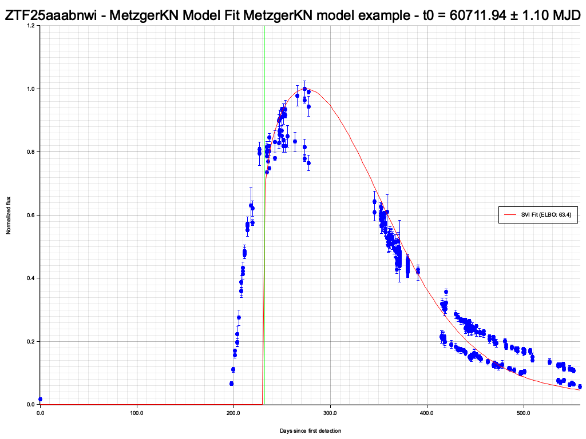
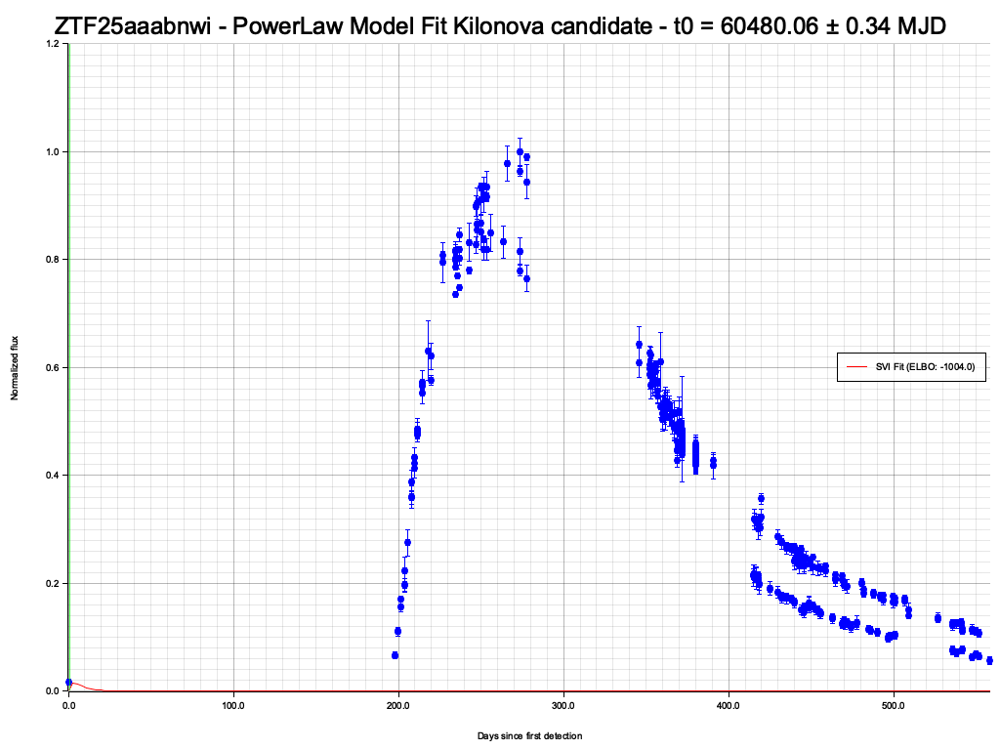
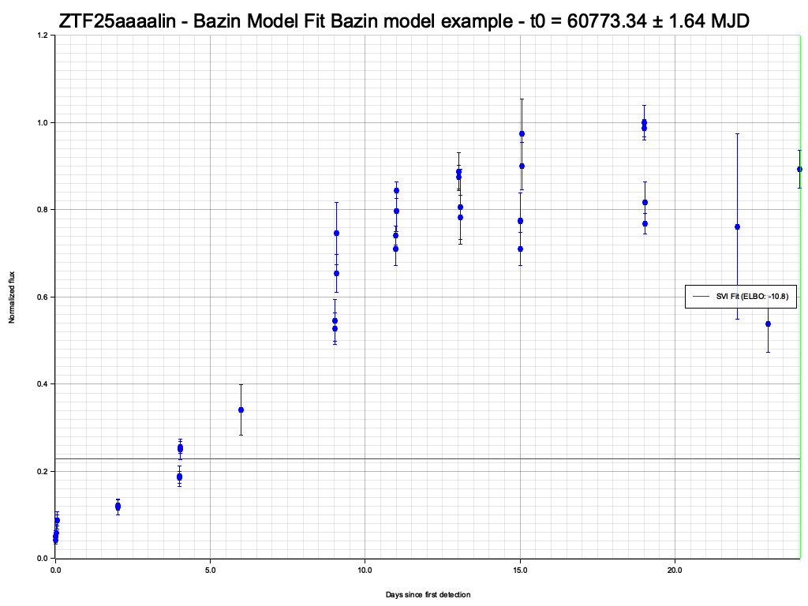
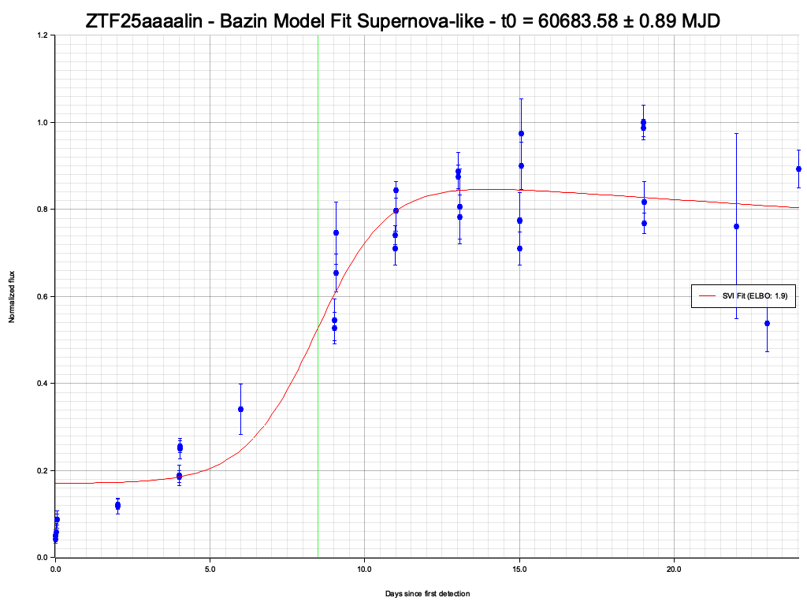
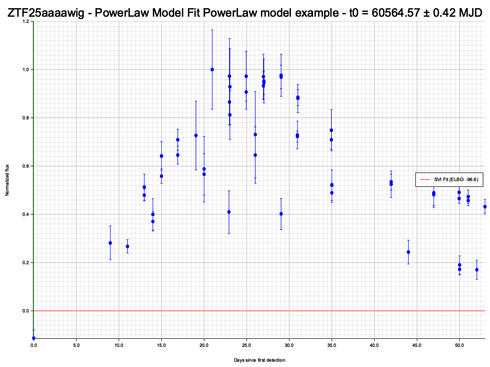
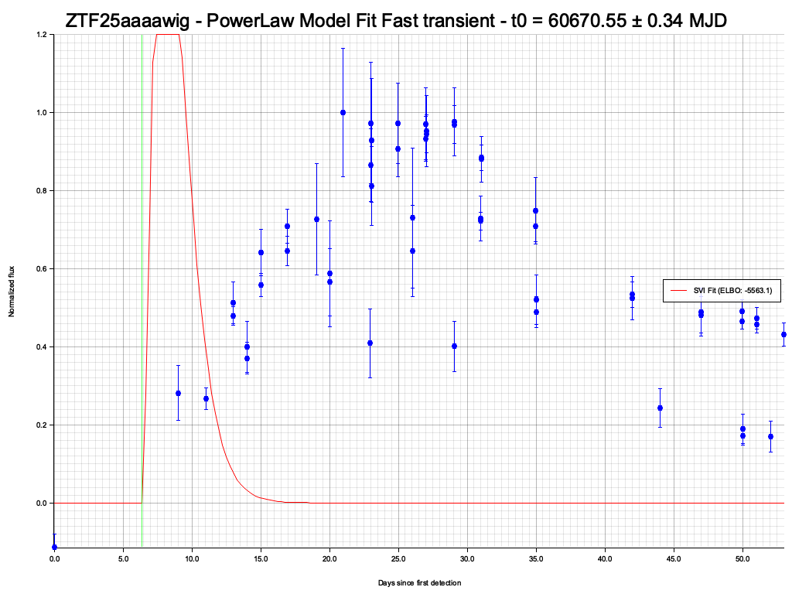

# Light Curve Classification Examples

ORIGIN classifies incoming optical transients using multiple forward models. Each model captures different physical processes, enabling the correlator to distinguish kilonova candidates from background transients.

## Kilonova Candidate (MetzgerKN)

ZTF25aaabnwi was identified as a kilonova candidate by the MetzgerKN forward model.

### Model Fit



The fit extracts physical parameters:

- Ejecta mass `M_ej`
- Ejecta velocity `v_ej`
- Opacity `κ`
- Merger time `t_0`

### Classification



Key indicators of a kilonova:

- Rapid rise (<1 day)
- Red color evolution from lanthanide-rich ejecta
- Smooth decline consistent with r-process heating (∝ t⁻¹·³)

## Type Ia Supernova (Bazin Model)

ZTF25aaaalin was classified as a supernova-like transient using the Bazin phenomenological model.

### Model Fit



The Bazin model:

```
f(t) = A × exp(-(t - t_0) / τ_fall) / (1 + exp(-(t - t_0) / τ_rise)) + c
```

### Classification



Supernovae are distinguished by:

- Weeks-long timescale (vs days for kilonovae)
- Symmetric rise and decline
- Blue colors at peak

This makes them easy to reject as kilonova candidates in the RAVEN correlator.

## Fast Transient (Power Law)

ZTF25aaaawig showed rapid power-law decay consistent with a GRB afterglow or other fast-evolving transient.

### Model Fit



Power-law decay: `f(t) ∝ (t - t_0)^(-α)`

### Classification



Fast transients with power-law indices α > 1 are consistent with GRB afterglow emission.

## Synthetic Validation


Validation of the classification pipeline against synthetic kilonova light curves with known injected parameters, demonstrating accurate parameter recovery.
