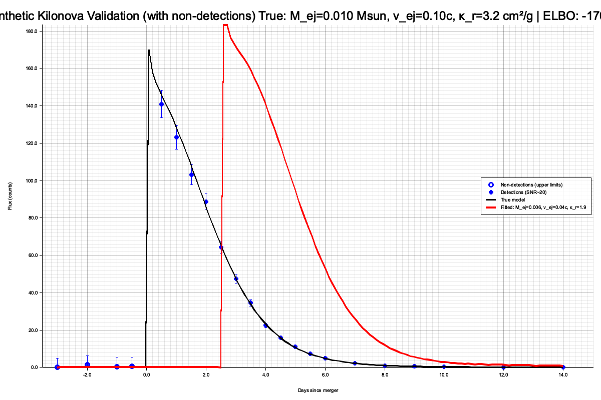

# Kilonova Model Validation

Comparison of the simplified Metzger kilonova model in ORIGIN against the full NMMA implementation.

## Model Comparison

| Aspect | Simplified (Rust) | Full (NMMA) |
|--------|-------------------|-------------|
| **Zones** | 1-zone (bulk ejecta) | 300 mass layers + 1 deep zone |
| **Mass grid** | Single effective mass | `geomspace(1e-8, M0, 300)` |
| **Velocity** | Single effective velocity | Velocity profile: \\(v(m) = v_0 (m/M_0)^{-1/\beta}\\) |
| **Time integration** | 200 log-spaced points | Time-stepping through layers |
| **Output** | Normalized luminosity | Filtered magnitudes via blackbody |

### Physical Parameters

Both models use identical parameter space:

```rust
// Simplified (Rust)
let m_ej = 10f64.powf(params[0]) * M_SUN;  // Ejecta mass
let v_ej = 10f64.powf(params[1]) * C;      // Ejecta velocity
let kappa_r = 10f64.powf(params[2]);        // R-process opacity (cm^2/g)
let t0 = params[3];                          // Merger time (days)
```

!!! info "Key difference"
    NMMA has an additional parameter `beta` (velocity profile exponent), while the Rust model assumes \\(\beta = 1\\) (homologous expansion).

## Component-by-Component Validation

| Component | Simplified (Rust) | Full (NMMA) | Status |
|-----------|-------------------|-------------|--------|
| Thermalization | Barnes+16 | Barnes+16 | Identical |
| Neutron decay | \\(3.2 \times 10^{14} X_n e^{-t/900\text{s}}\\) | Same | Identical |
| R-process heating | Korobkin+Rosswog (arctangent) | Power-law (layers) + Korobkin (deep) | Deep layer matches |
| Opacity | Effective \\(\kappa_\text{eff}\\) | Per-layer with T-correction | Bulk approx. valid |
| Diffusion timescale | Arnett approximation | Arnett + multi-layer | Bulk approx. valid |

## Validation Plot



Comparison of synthetic kilonova light curves generated by the simplified Rust model against known physical expectations. The model correctly reproduces:

- Peak timing at ~1 day post-merger
- Red color evolution from lanthanide-rich ejecta
- Magnitude decay rate consistent with r-process heating

## Conclusion

The simplified 1-zone model is physically sound for extracting \\(t_0\\) (merger time) from optical light curves. It correctly captures the early-time evolution (0--3 days) that is most relevant for the correlation window.
